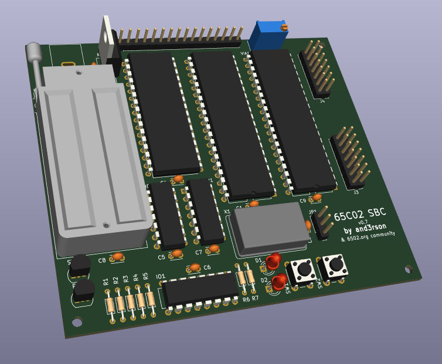

# m6502



Simple SBC based on W65C02S

Discussion: <http://forum.6502.org/viewtopic.php?f=12&t=7501>

Pull with `git pull --recurse-submodules`.

# Components

- CPU: W65C02S(6TPG)
- RAM: AS6C1008
- ROM: W27C512
- I/O: VIA W65C22N(6TPG)
- Glue logic: 74HC00, 74HC138
- 1 MHz oscillator (DIP-14)
- Traco Power TSC 1-2450 (drop-in replacement for LD7805)

I/O:
- 2004 LCD 16-pin header
- 2 ports & control lines from 6522 VIA

To be added in future versions:
- 8580R5 SID
- 6551 ACIA

# Resources

- [Kicad files](./kicad) - <https://www.kicad.org/>
- [DipTrace PCBs](./diptrace) - <https://diptrace.com/>
- [Circuits](./circuits) (created with [Digital](https://github.com/hneemann/Digital))
- [ROM sources](./rom) (requires [cc65](https://cc65.github.io/) compiler)
- [7-segment decoder](./sevenseg) using GAL16V8 (includes `galasm` as submodule)

# Memory map

```
+-------+-----+------------------------+
| RANGE | TYP | Notes                  |
+-------+-----+------------------------+
| $0000 | RAM | NAND(A14, A15)         |
| $BFFF | 48k |                        |
+-------+-----+------------------------+
| $C000 | I/O | !RAM && !A12 && !A13   |
|  ...  | 4k  | $C000-$C0FF - LCD      |
|  ...  |     | $C100-$C1FF - 6522 VIA |
|  ...  |     | $C200-$C2FF - EEPROM?  |
| $CFFF |     | $C300-$C3FF - SID?     |
+-------+-----+------------------------+
| $D000 | n/a | Reserved for future    |
| $DFFF | 4k  |                        |
+-------+-----+------------------------+
| $E000 | ROM | !RAM && A13            |
| $FFFF | 8k  |                        |
+-------+-----+------------------------+
```

# Links
- 6502 Primer: http://wilsonminesco.com/6502primer/
- Address Selector: https://circuitverse.org/simulator/embed/6502-address-selector
- Read-Write Selector: https://circuitverse.org/simulator/embed/6502-read-write-selector
- SID (HVSC) format: https://gist.github.com/cbmeeks/2b107f0a8d36fc461ebb056e94b2f4d6
