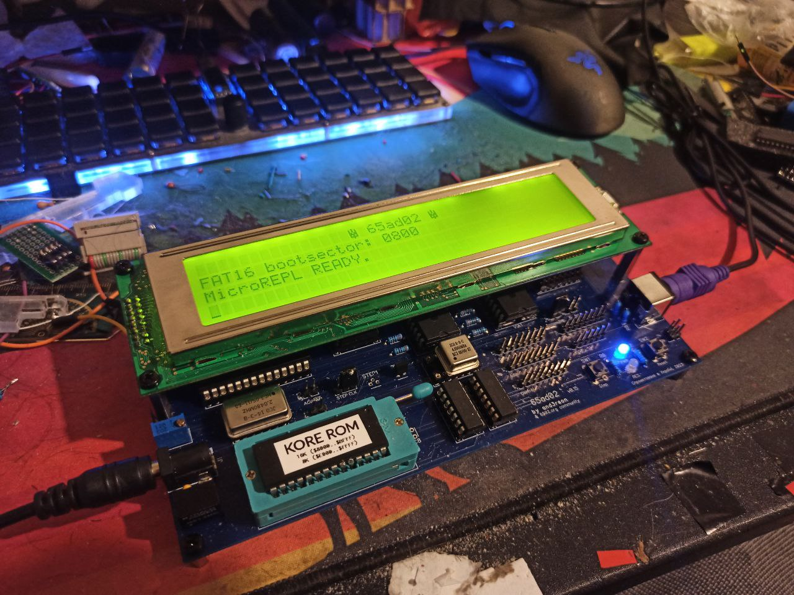
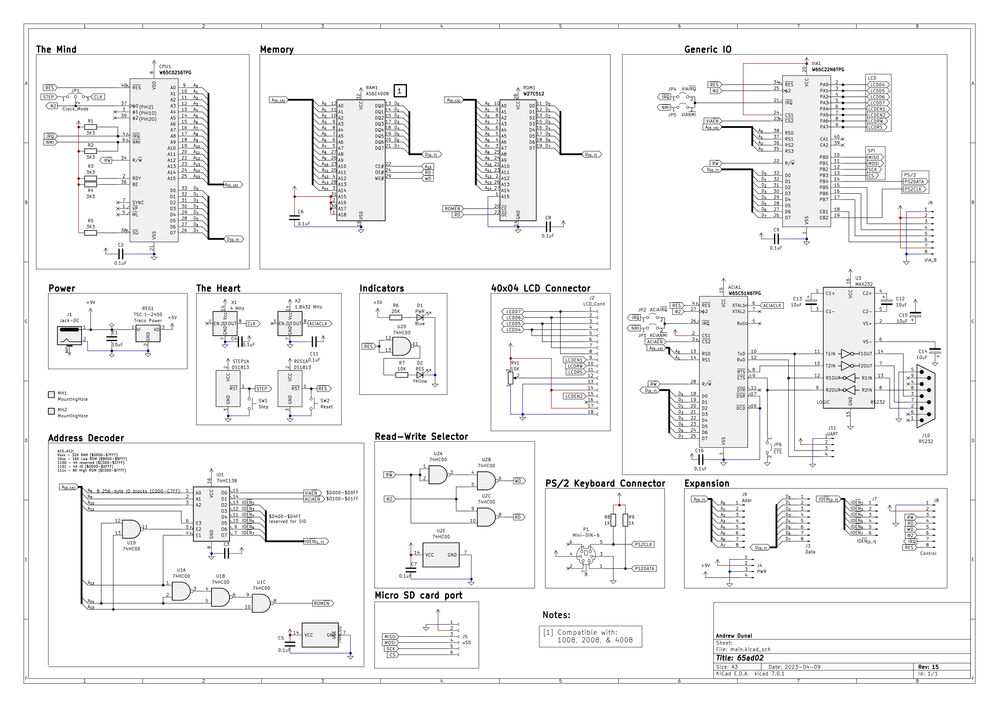
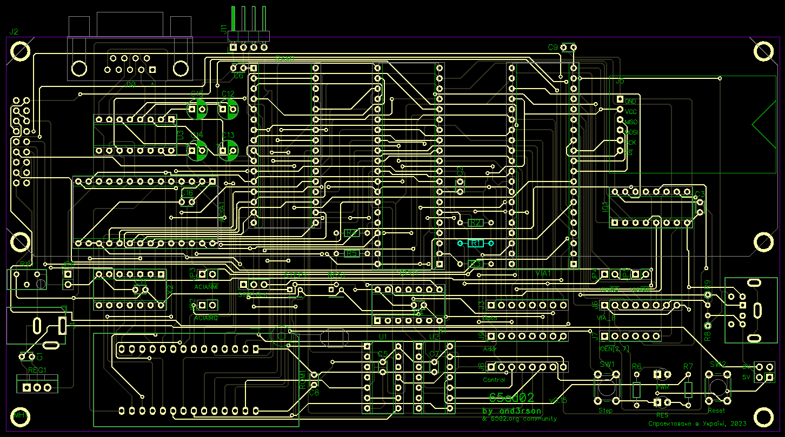
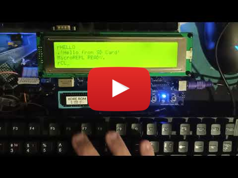

# 65ad02



Simple SBC based on W65C02S

Discussion: <http://forum.6502.org/viewtopic.php?f=12&t=7501>

Pull with `git pull --recurse-submodules`.

# Components

- CPU: W65C02S(6TPG-14)
- RAM: AS6C1008
  > Pin-compatible with AS6C2008 & AS6C4008.
- ROM: W27C512
- I/O: VIA W65C22<ins>N</ins>(6TPG-14) & ACIA W65C51<ins>N</ins>(6TPG-14)
  > Note: I'm using NMOS-compatible versions (<ins>N</ins> suffix) with open-drain /IRQ line.<br />
  > See http://archive.6502.org/datasheets/wdc_w65c22_sep_13_2010.pdf (page 25) for more details.
- Glue logic: 74HC00, 74HC138, MAX3232
- 8 MHz oscillator for 65C02, 1.8432 MHz oscillator for ACIA 6522
  > Using a machine-tooled socket actually allows to connect JCO-8 or JCO-14 oscillators.
- Traco Power TSR 1-2450 (drop-in replacement for LD7805)

I/O:
- 4004 LCD 16-pin header (through 6522)
- PS/2 keyboard
- Micro SD Card
- Pin header for VIA (Port B)
- Pin headers for address bus, data bus, & CPU control lines

To be added in future versions:
- 8580R5 SID

V15 schematic:


V15 PCB:


# ROM

Kernel code currently provides the following features:
- Simple REPL shell to monitor memory & run programs
- HD44780-based 4004 LCD (through VIA)
- PS/2 keyboard (through VIA)
- Micro SD Card in SPI mode (through VIA)
- Basic FAT16 support - listing root folder, loading/executing programs

# Resources

- [Kicad files](./kicad) - <https://www.kicad.org/>
- [DipTrace PCBs](./diptrace) - <https://diptrace.com/>
- [Circuits](./circuits) (created with [Digital](https://github.com/hneemann/Digital))
- [ROM sources](./rom) (written in 6502 Assembly, requires [cc65](https://cc65.github.io/) compiler)
- [SD Card programs](./sdcard) (written in 6502 C, requires [cc65](https://cc65.github.io/) compiler)
- [GAL stuff](./gal) (hexadecimal 7-segment decoder, address decoder, etc using GAL16V8/GAL20V8, includes `galasm` as submodule)
- [Composite video test](./compvid) using ATtiny45 (requires [avra](https://github.com/Ro5bert/avra))

# Memory map

```
+--------------+-------+------------------+------+------------------------------------------+
| RANGE        | TYPE  | ADDR             | SIZE | Notes                                    |
+--------------+-------+------------------+------+------------------------------------------+
| $0000..$0FFF | RAM   | 0000------------ | 32 K | /EN = A15                                |
| $1000..$1FFF |       | 0001------------ |      | $0000..$1000 - zeropage & video buffer   |
| $2000..$2FFF |       | 0010------------ |      | $1000..$7FFF - programs from SD Card     |
| $3000..$3FFF |       | 0011------------ |      |                                          |
| $4000..$4FFF |       | 0100------------ |      |                                          |
| $5000..$5FFF |       | 0101------------ |      |                                          |
| $6000..$6FFF |       | 0110------------ |      |                                          |
| $7000..$7FFF |       | 0111------------ |      |                                          |
+--------------+-------+------------------+------+------------------------------------------+
| $8000..$8FFF | LOROM | 1000------------ | 16 K | /EN = NAND(A15, NAND(A14))               |
| $9000..$9FFF |       | 1001------------ |      | Contains OS ("MicroREPL")                |
| $A000..$AFFF |       | 1010------------ |      |                                          |
| $B000..$BFFF |       | 1011------------ |      |                                          |
+--------------+-------+------------------+------+------------------------------------------+
| $C000..$CFFF | N/C   | 1100------------ | 4 K  | Unused, may add extra '138 with /GA=/A13 |
+--------------+-------+------------------+------+------------------------------------------+
| $D000..$DFFF | I/O   | 1101------------ | 4 K  | G = A12, /GA = A13, /GB = NAND(A15, A14) |
|              |       | 1101-000-------- | 256B | $D000..$D0FF - 6522 VIA                  |
|              |       | 1101-001-------- | 256B | $D100..$D1FF - 6551 ACIA                 |
+--------------+-------+------------------+------+------------------------------------------+
| $E000..$EFFF | HIROM | 1110------------ | 8 K  | /EN = NAND(/NAND(A15, A14), A13)         |
| $F000..$FFFF |       | 1111------------ |      | COntains Kernel ("Kore")                 |
+--------------+-------+------------------+------+------------------------------------------+

LOROM (10xx) || HIROM (111x):
/EN = A15 && (/A14 || (A14 && A13))
/EN = NAND(A15, /A14 || /NAND(A14, A13))
/EN = NAND(A15, NAND(A14, NAND(A14, A13)))
```

# So what can you do with it?

Playing snake, for example:

[](https://www.youtube.com/watch?v=boeysL1Isg4)

# Credits & references
- [6502.org community](forum.6502.org/) - Limitless help & support
- https://www.masswerk.at/6502/6502_instruction_set.html
- https://github.com/4x1md/kicad_libraries - Mini-DIN-6 symbol & footprint
- http://39k.ca/reading-files-from-fat16/
- https://laughtonelectronics.com/Arcana/KimKlone/Kimklone_opcode_mapping.html - cool illegal NOPs
- https://octopart.componentsearchengine.com/part.php?partID=570717&ref=octopart - Aries 28-526-10 footprint
- https://github.com/daprice/keyswitches.pretty - MX switches
- https://components101.com/sites/default/files/component_datasheet/Micro-SD-Card-Module-Datasheet.pdf - MicroSD card module datasheet & dimensions

# Links
- 6502 Primer: http://wilsonminesco.com/6502primer/
- Address Selector: https://circuitverse.org/simulator/embed/6502-address-selector
- Read-Write Selector: https://circuitverse.org/simulator/embed/6502-read-write-selector
- SID (HVSC) format: https://gist.github.com/cbmeeks/2b107f0a8d36fc461ebb056e94b2f4d6
