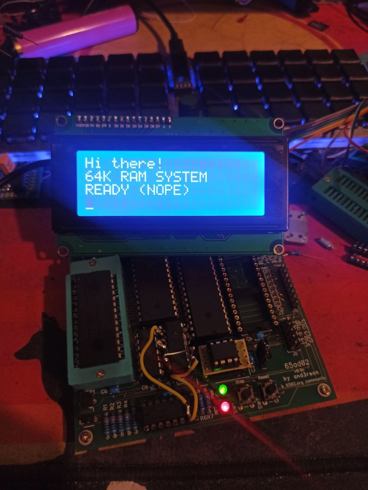
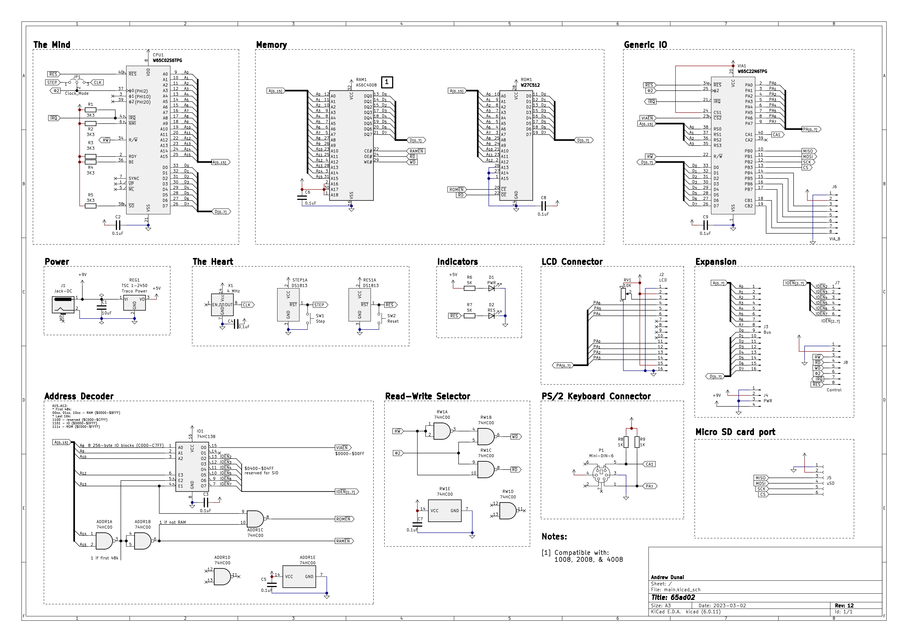
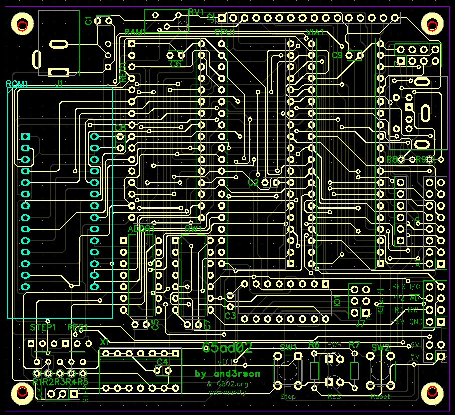

# 65ad02




Simple SBC based on W65C02S

Discussion: <http://forum.6502.org/viewtopic.php?f=12&t=7501>

Pull with `git pull --recurse-submodules`.

# Components

- CPU: W65C02S(6TPG)
- RAM: AS6C1008
  > Pin-compatible with AS6C2008 & AS6C4008.
- ROM: W27C512
- I/O: VIA W65C22<ins>N</ins>(6TPG)
  > Note: I'm using NMOS-compatible version (<ins>N</ins> suffix) with open-drain /IRQ line.<br />
  > See http://archive.6502.org/datasheets/wdc_w65c22_sep_13_2010.pdf (page 25) for more details.
- Glue logic: 74HC00, 74HC138
- 4 MHz oscillator (DIP-14)
  > Using a machine-tooled socket actually allows to connect JCO-8 or JCO-14 oscillators.
- Traco Power TSR 1-2450 (drop-in replacement for LD7805)
  > I had some issues with it when connecting 8580R5 SID: regulator was simply not powering on<br />
  > and was getting hot. Sticking to an L7805 for now. Not sure if it's a defect or if I'm doing something wrong.

I/O:
- 2004 LCD 16-pin header (through 6522)
- PS/2 keyboard
- Micro SD Card
- Pin header for VIA: PB0..PB7, CB0, CB1
- Pin headers for address bus, data bus, & CPU control lines

To be added in future versions:
- 8580R5 SID
- 6551 ACIA

New V12 schematic:


New V12 PCB:


# ROM

Kernel code currently provides the following features:
- Simple REPL shell to monitor memory & run programs
- HD44780-based 2004 LCD (through VIA)
- PS/2 keyboard (through VIA)
- Micro SD Card in SPI mode (through VIA)
- Basic FAT16 support - listing root folder, finding & reading files

# Resources

- [Kicad files](./kicad) - <https://www.kicad.org/>
- [DipTrace PCBs](./diptrace) - <https://diptrace.com/>
- [Circuits](./circuits) (created with [Digital](https://github.com/hneemann/Digital))
- [ROM sources](./rom) (requires [cc65](https://cc65.github.io/) compiler)
- [GAL stuff](./gal) (hexadecimal 7-segment decoder, address decoder, etc using GAL16V8/GAL20V8, includes `galasm` as submodule)
- [Composite video test](./compvid) using ATtiny45 (requires [avra](https://github.com/Ro5bert/avra))

# Memory map

```
+-------+-----+------------------------+
| RANGE | TYP | Notes                  |
+-------+-----+------------------------+
| $0000 | RAM | NAND(A14, A15)         |
| $BFFF | 48k |                        |
+-------+-----+------------------------+
| $C000 | n/a | Reserved for future    |
| $CFFF | 4k  |                        |
+-------+-----+------------------------+
| $D000 | I/O | !RAM && !ROM && A12    |
|  ...  | 4k  | $D000-$D0FF - LCD      |
|  ...  |     | $D100-$D1FF - 6522 VIA |
|  ...  |     | $D200-$D2FF - EEPROM?  |
|  ...  |     | $D300-$D3FF - EEPROM?  |
| $DFFF |     | $D400-$D4FF - SID?     |
+-------+-----+------------------------+
| $E000 | ROM | !RAM && A13            |
| $FFFF | 8k  |                        |
+-------+-----+------------------------+
```

# Credits & references
- [6502.org community](forum.6502.org/) - Limitless help & support
- https://www.masswerk.at/6502/6502_instruction_set.html
- https://github.com/4x1md/kicad_libraries - Mini-DIN-6 symbol & footprint
- http://39k.ca/reading-files-from-fat16/
- https://octopart.componentsearchengine.com/part.php?partID=570717&ref=octopart - Aries 28-526-10 footprint
- https://github.com/daprice/keyswitches.pretty - MX switches
- https://components101.com/sites/default/files/component_datasheet/Micro-SD-Card-Module-Datasheet.pdf - MicroSD card module datasheet & dimensions

# Links
- 6502 Primer: http://wilsonminesco.com/6502primer/
- Address Selector: https://circuitverse.org/simulator/embed/6502-address-selector
- Read-Write Selector: https://circuitverse.org/simulator/embed/6502-read-write-selector
- SID (HVSC) format: https://gist.github.com/cbmeeks/2b107f0a8d36fc461ebb056e94b2f4d6
